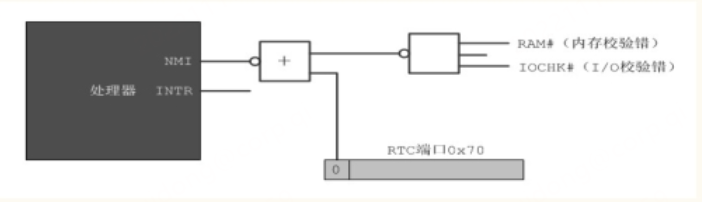

1. 第42页，检测点4.2，第1题。本程序有误，正确的内容是：（由网易邮箱读者'小小鸟'、QQ读者'闪耀'、'流星梦'和'二玉'发现）
```
mov ax,0xb800
mov ds,ax
mov byte [0x00],'a'
mov byte [0x02],'s'
mov byte [0x04],'m'
jmp $
times 510-($-$$) db 0
db 0x55,0xaa
```

2. 第52页，第24行，正确的内容是：（由QQ读者'闪耀'发现）
```
mov ax,[0x02] ;按字操作
```

3. 第53页，第4行，正确的内容是：（由QQ读者'tome'发现）
```
mov [0x02],bl
```

4. 第65、80、94、129、138页中，需要更正和明确loop指令、短转移指令jmp short、相对近转移指令jmp near和相对近调用指令call near的操作数计算方法和执行过程。（由网易邮箱读者'小小鸟'、QQ读者'艾小羊'提出）

    首先，这些指令的操作数都是相对于目标位置处的偏移量。但需要指出的是，偏移量的计算方法取决于实际的编译器，书中所说的“用目标位置处的汇编地址减去当前指令的汇编地址，再减去当前指令的长度”，不应算错。

    其次，处理器的执行过程严格地说，是非IA-32架构的组成部分。因此，除了结果是确定的，各步骤的先后次序取决于处理器的设计。历史上，指令的执行过程有不同的解释和说法。但本书对这些指令执行过程的解释比较模糊和武断。为严谨起见，再统一描述如下：
    
    在以上指令的编译阶段，编译器用目标位置处的汇编地址减去当前指令的下一条指令的汇编地址，结果做为操作数；处理器在执行一条指令时，指令指针寄存器IP会自动指向下一条指令。因此，当以上指令执行时，IP的内容就是下一条指令的偏移地址。处理器用IP的内容加上指令的操作数（如果是call near指令，还要压入IP的内容），并用该值取代IP中的原有内容。

5. 第79页，检测点6.1。正确的内容是：（由QQ读者'闪耀'发现）

    选择填空：MOVSB指令每次传送一个（ ），MOVSW指令每次……

6. 第86页，第26行：（由QQ读者'闪耀'发现）

    原指令为“idiv bl”，正确的是“idiv bx”

7. 第92页，检测点6.4，第2题，（由QQ读者'闪耀'发现）

    中间一句的正确内容是：“AX的内容等于BX的内容时，转移到标号lbz处执行；” 

8. 第101页，7.5.2节。本节第10行：（由QQ读者'闪耀'发现）

    正确的内容是：“……为了方便，源程序第50行，直接将<b><font color=red>DL中的余数</font></b>……。” 

9. 第104页，7.5.4节。本节第12行。（由QQ读者'闪耀'发现）

    正确的内容是：mov ax,cs

10. 第136页，倒数第11行。（由QQ读者'闪耀'发现）

    正确的内容是：第四种指令格式和第三种类似，只是……

11. 第137页，倒数第14行。（由QQ读者'tome发现）

    正确的内容是：如图<b><font color=blue>8-15</font></b>所示。

12. 第144页，8.4.6小节内第2行。

    少了一个字。应当是“为此，需要首先<b><font color=green>识</font></b>别出它们。”

13. 第152页，倒数第3行。（由QQ读者'闪耀'发现）

    应改为“那么它每个引脚IR0~IR7所对应的中断号分别为0x08`~`<b><font color=green>0x0F</font></b>。” 

14. 第155页，图9-4。（由QQ读者'艾小羊'提出）

改为下图：
